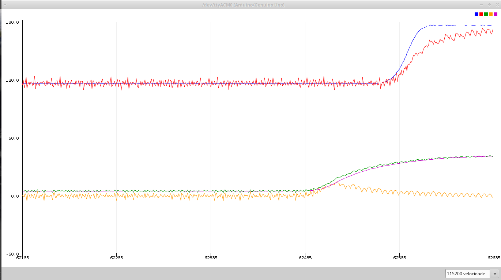

# Controle de luminosidade com compensador discreto PI

Este projeto foi desenvolvido como prática para a matéria de Sistemas de controle realimentados da Universidade Federal de Uberlândia.

## Materiais

- **Arduino uno R3**
- **Potenciometro 10K**
- **Led de alto brilho**
- **Fotoresistor ou LDR**
- **Resistor 10K**
- **Protoboard**
- **Jumpers**
- **Tubo de pincel**

# Esquema eletrônico

O circuito a ser montado é o seguinte

**Observação** o LDR deve estar próximo e com a face receptora voltada para o led como nas imagens abaixo

Desta forma será possivel executar melhores açoes de controle sobre a luminosidade do led.

A montagem final ficou da seguinte forma:

# Teoria

Um sistema de controle realimentado temos a planta ou processo a ser controlado , os sensores e atuadores e o controlador ou compensador. Esses elementos se relacionam em um sistema contínuo realimentado da seguinte forma:

Em um sistema com controlador discreto a única diferença está no fato de que a compensação ocorre dentro do microcontrolador da seguinte forma:

No caso deste projeto o potenciômetro  fará  o  papel  do  ‘setpoint’  e,  portanto,  fará  com  que  o  brilho  do  led , que faz o papel de atuador , varie.  Qualquer  variação  na  luminosidade  externa  deverá  ser  corrigida  pelo  controlador  PI  de  forma  a  manter  o  valor  do  ‘setpoint'.

**Observações:** ***O sensor*** ldr os jumpers e a protoboard não evitam que ruídos de alta frequência entrem no microcontrolador portanto é necessário que se faça a filtragem do sinal para aumentar a estabilidade do mesmo. para simplificar foi implementado um [filtro de média móvel](https://www.youtube.com/watch?v=GBHZfOVcwro) passa-baixas tanto para o potenciometro quanto para o ldr. ***O conversor*** A/D do arduino possui 10 bits porém o PWM, que irá controlar o nível de brilho do led, possui 8 bits portanto é necessário fazer uma conversão de 0,1023 para 0,255; esta conversão pode ser feita usando a função *map* do arduino eu optei por converter deslocando a os 8 bits mais significativos duas casas à esquerda o que faz o mesmo da função *map*.

## Implementação do Controle

Primeiramente devemos ter o erro atuante em mãos, este erro é a diferença entre o que o sensor lê e o setpoint logo:

**erro = pot - ldr;**

A parcela proporcional é dada por:

**P = erro * Kp;**

E a parcela integral:

**I = (I + erro * Ki)* delta;**

onde delta é a diferença de tempo entre duas amostras medidas. Como a ação integral recebe ela mesma mais uma parte do erro caso em alguma situação o atuador chegue a saturar ou cortar ocorrerá o que chamamos de [wind up](http://www.ece.ufrgs.br/~jmgomes/pid/Apostila/apostila/node31.html) , onde a parcela integral tenderá a +oo ou -oo. Por conta dessa possibilidade devemos tratar a resposta final para que caso ela ultrapasse o valor máximo ou o valor mínimo , ela receba respectivamente uma constante no valor máximo ou uma constante no valor mínimo. Este tratamento se dá em:

**pi = pi < 0 ? 0 : pi;**

**pi = pi > 255 ? 255 : pi;**

## Conclusões

Utilizando a ferramenta *Serial plotter* do arduino IDE podemos verificar que o objetivo foi alcançado com êxitos. Nota-se ainda um pequeno ruído na leitura do ldr porém como o filtro digital implementado causa um atraso no sistema esse foi o melhor ponto entre filtragem e velocidade encontrado. Abaxio podemos ver
a serial plotter com o sistema funcinando:

Todas as caracteristicas desritas e previstas são obsevadas neste gráfico.

